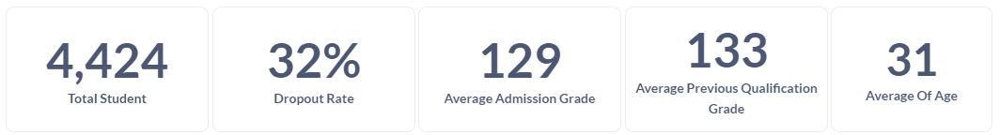
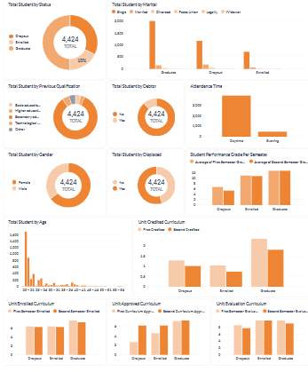

# Proyek Akhir: Menyelesaikan Permasalahan Perusahaan Edutech

## Business Understanding
Jaya Jaya Institut merupakan salah satu institusi pendidikan perguruan yang telah berdiri sejak tahun 2000. Hingga saat ini ia telah mencetak banyak lulusan dengan reputasi yang sangat baik. Akan tetapi, terdapat banyak juga siswa yang tidak menyelesaikan pendidikannya alias *dropout*.

Jumlah *dropout* yang tinggi ini tentunya menjadi salah satu masalah yang besar untuk sebuah institusi pendidikan. Oleh karena itu, Jaya Jaya Institut ingin mendeteksi secepat mungkin siswa yang mungkin akan melakukan *dropout* sehingga dapat diberi bimbingan khusus.

### Permasalahan Bisnis
Jumlah *dropout* siswa dapat menjadi salah satu tolak ukur kredibelitas dan kualitas layanan pendidikan yang diberikan oleh suatu Institusi Pendidikan. Tingkat *dropout* tentunya akan berimbas pada kepercayaan masyarakat yang ingin menempuh pendidikan di Institusi tersebut yang secara lansung mempengaruhi jumlah peserta didik di Institusi tersebut. Oleh karena itu berdasarkan hal tersebut dapat dirumuskan permasalahan sebagai berikut.
- Berapa jumlah siswa yang mengalami *Dropout* ? 
- Faktor apa saja yang mempengaruhi *Dropout* siswa ? 
- Berapa *Dropout Rate* dari Jaya Jaya Institut ? 
- Berapa Rerata *Admission Grade* dan *Previous Qualification Grade* siswa yang mengalami *dropout* ? 
- Berapa rerata umur siswa yang mengalami *dropout* ? 
- Berapa Jumlah siswa yang mengalami *dropout* ? 
- Bagaimana Status *Marital* siswa yang mengalami *dropout* ? 
- Apa kualifikasi sebelumnya dari siswa yang mengalami *dropout* ? 
- Berapa banyak kah siswa yang mengalami dropout berdasarkan *Attendence Time* ?
- Apakah siswa yang mengalami *dropout* berstatus *Debtor* ? 
- Apakah siswa yang mengalami *dropout* berstatus *Displaced* ? 
- Berapa banyak siswa yang mengalami *dropout* berdasarkan *gender* ? 
- Bagaimana performa belajar siswa tiap semesternya ? 


### Cakupan Proyek
Proyek ini mencangkup sebuah business dashboard yang berfungsi sebagai monitoring *student performance* yang berfokus pada siswa yang mungkin melakukan *dropout* dan sebuah prototipe pembelajaran mesin yang memprediksi apakah seorang siswa akan melakukan *dropout* atau tidak berdasarkan fitur masukan. Melalui data yang disajikan dengan dashboard tersebut akan didapatkan insight bermakna untuk membuat sebuah kebijakan / keputusan dalam mengurangi dropout rate dan mengetahui lebih awal siswa yang mungkin akan melakukan dropout untuk diberikan solusi ataupun penanganan.

Dashboard akan dibuat menggunakan Metabase yang dihubungkan ke database postgresql yang dihosting di platform Supabase.

Pada Metabase data akan dibuat menjadi sebuah model data yang nantinya akan proses menjadi beberapa fitur dashboard seperti :

- Fitur jumlah data terkait
- Visualisasi data dengan berbagai diagram / chart

Sedangkan Prototipe akan dideploy ke dalam platform streamlit cloud dimana user atau pengguna akan memasukan fitur masukan dan akan mendapatkan hasil prediksinya.

### Persiapan

Sumber data: [Student Performance Prediction](https://archive.ics.uci.edu/dataset/697/predict+students+dropout+and+academic+success)

Setup environment:
```
pip install -r requirement.txt
```

## Business Dashboard
Dashboard yang dibuat terdiri atas visualisasi data dalam bentuk aktual jumlah data dan grafik. Adapun penjelasan tiap fitur dashboard yang dibuat sebagai berikut :
1. Fitur Jumlah data aktual yang memberikan nilai yang ada pada dataset.
    
    Gambar 1. Fitur Data Aktual

Adapun fitur tersebut berfungsi untuk memonitor nilai aktual data saat ini yang terdiri atas :
- Jumlah Siswa
- Dropout Rate 
- Rata rata Admission Grade
- Rata rata Previous Qualification
- Rata rata umur siswa saat mendaftar

2. Grafik data bagi siswa yang mengalami droput berfungsi sebagai memonitor pembanding dan komposisi data yang terdiri atas :

Gambar 2. Grafik data siswa

- Grafik pie chart Total Student by status mendeskripsikan komposisi jumlah siswa berdasarkan status nya. 
- grafik barchart Total student by marital status mendeskripsikan jumlah siswa berdasarkan status pernikahan.
- grafik pie chart total student by previous qualification mendeskripsikan jumlah siswa berdasarkan kualifikasi saat mendaftar. 
- Grafik pie chart total student by debtor mendeskripsikan jumlah siswa berdasarkan apakah siswa tersebut debtor atau bukan. 
- Grafik bar chart attendence time mendeskripsikan jumlah siswa berdasarkan waktu kelas yang diambil apakah reguler (siang) atau karyawan (malam).
- Grafik pie chart total student by chart dan displaced mendeskripsikan jumlah siswa berdasarkan jenis kelamin dan status pindahan atau bukan. 
- Grafik bar chart total student berdasarkan umur mendeskripsikan jumlah siswa berdasarkan umurnya. 
- grafik barchart student performance, unit credited, enrolled, approved, dan evaluation curriculum mendeskripsikan performa siswa pada proses pembelajaran selama dua semester. 

## Menjalankan Sistem Machine Learning
Prototipe machine learning dibangun diatas platform streamlit untuk  deployment sederhana dimana user akan memasukan fitur yang diminta dan akan mendapatkan hasil prediksi apakah siswa tersebut terprediksi dropout atau tidak. 

```
~ Menjalankan secara Online ~ 
1. Buka stremlit cloud pada link :
https://education-dropout-prediction.streamlit.app/
2. Masukan fitur pada widget inputan
3. Klik tombol Predict untuk mendapatkan hasil prediksi

~ Menjalankan secara Offline ~ 
1. Jalankan aplikasi streamlit dengan mengetikan perintah :
   streamlit run app.py
2. Masukan fitur pada widget inputan
3. Klik tombol Predict untuk mendapatkan hasil prediksi
```

## Conclusion
Berdasarkan hasil analisa yang telah dilakukan, didapatkan informasi bahwa siswa yang mengalukan dropout didominasi berasal dari status pernikahan single dengan umur dibawah kisaran 30 tahun. Dimana siswa tersebut mengambil kelas reguler (siang) dan memiliki rerata performance grade / nilai di akhir semester satu dan dua relatif lebih kecil dibandingkan siswa yang telah lulus ataupun masih belajar (enrolled) yaitu dibawah kisaran 7. Selain itu jumlah siswa dropout sejumlah 47 % berasal dari siswa pindahan. Sehingga dapat diambil kesimpulan bahwa fitur `Displaced` dan `Student Performance Grade per Semester` menjadi tolak ukur utama pada siswa yang mungkin mengalami dropout. 

### Rekomendasi Action Items
Berdasarkan hasil analisa yang telah dilakukan, dapat diambil beberapa rekomendasi yang dapat diterapkan oleh Jaya Jaya Institut antara lain : 
- Mengakomodir permasalahan siswa pindahan secara lebih lanjut dengan memberikan bimbingan konseling terhadap perubahan kultur dari institusi pendidikan sebelumnya dan sekarang.
- Memberikan bimbingan terpadu bagi siswa yang mengalami ketertinggalan pembelajaran di semester 1 untuk meningkatkan performa nya di semester 2.
